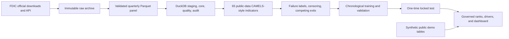

# U.S. Bank Risk Early-Warning & Regulatory Data Platform

A reproducible FDIC regulatory-data platform that turns quarterly public filings into governed data-quality controls, public-data CAMELS-style indicators, chronological failure-risk rankings, and an explainable Streamlit demonstration.

> This is a research ranking model—not a calibrated failure-probability model, official CAMELS rating, supervisory tool, or investment recommendation. The public demo uses synthetic institutions.

## Validated result

On a locked chronological test containing 17 unique FDIC failures, the selected ranking model achieved a PR-AUC of 0.1483 versus a 0.0005 no-skill baseline and captured 10 of 17 failures within the top 5% of quarterly rankings.

That result is evidence of ranking signal in this test, not a 14.8% precision claim. Calibration was weak (slope 0.315), the event count was small, and performance varied materially by year and asset-size band. Of 5,670 top-5% bank-quarter alerts, 5,637 were not positive failure-label rows; a high rank requires review, not a conclusion.

| Locked-test measure | Frozen result |
|---|---:|
| Period | 2019 Q1–2024 Q4 |
| Bank-quarter rows | 113,117 |
| Positive bank-quarter rows | 58 |
| Unique FDIC failures | 17 |
| PR-AUC / no-skill PR-AUC | 0.148342 / 0.000513 |
| Institution-clustered PR-AUC 95% interval | 0.0353–0.3164 |
| ROC AUC | 0.794209 |
| Brier score | 0.000604 |
| Top-1% / top-5% / top-10% event capture | 10 / 10 / 12 of 17 |
| Median first top-5% lead time | 284 days |
| Locked-test access | Once |

PR-AUC summarizes the precision–recall curve across thresholds. Precision is threshold-specific. Event capture counts unique failed institutions reached by a review budget. Calibration asks whether numerical scores align with observed event frequencies; here, weak calibration is why the interface exposes same-quarter ranks and tiers rather than probabilities.

## Why it matters

Bank-risk analysis is as much a data-governance problem as a modelling problem. This project establishes identifier continuity, source-to-target lineage, denominator controls, competing-exit and right-censoring logic, same-quarter peer construction, chronological validation, and controlled locked-test access before presenting a ranking.

## Architecture



The governed research build contains 698,804 unique bank-quarter rows, 11,073 historical institutions, and 101 quarters from 2001 Q1 through 2026 Q1. Full raw data, the 18.4-million-row peer table, DuckDB binaries, model binaries, and institution-level prediction outputs are intentionally excluded from the release candidate.

## Methodology at a glance

- Source audit: copied inputs are hashed; API pages, quarter files, and the combined panel reconcile exactly.
- SQL model: DuckDB schemas separate raw, staging, core, quality, audit, and reporting concerns.
- Risk indicators: 65 documented capital, asset-quality, earnings, liquidity/funding, concentration, growth, temporal, and quality measures; these are never described as official CAMELS ratings.
- Peer benchmarks: quarter-specific groups prevent future-population leakage; undersized groups are flagged.
- Labels: FDIC failures remain separate from assistance transactions and structural exits; censored rows are not treated as confirmed negatives.
- Modelling: expanding chronological validation, training-only preprocessing, frozen model selection, and one locked-test access.
- Presentation: scores become same-quarter percentiles and review tiers because calibration is weak.

## Dashboard pages

The Streamlit app includes Executive Overview, Current Watchlist, Bank Detail, Peer Comparison, Model Validation, Case Studies, Data Quality and Lineage, and Methodology and Limitations. In public demo mode, all institution-level records and cases are deterministic synthetic examples; only validation summaries are frozen aggregate research evidence.

The watchlist's 1%, 5% and 10% review budgets use the complete latest-quarter population and same-quarter driver explanations. In the included 100-institution demo, those settings show 1, 5 and 10 institutions before optional filters. The saved `current_watchlist` export remains the frozen top-5% snapshot; it does not limit the interactive page's broader budget.

## Quick-start demonstration

Python 3.11 or newer is required.

```powershell
python -m venv .venv
.\.venv\Scripts\python.exe -m pip install -r requirements.txt
.\.venv\Scripts\python.exe scripts\validate_environment.py
.\.venv\Scripts\python.exe scripts\run_demo.py
```

macOS or Linux:

```bash
python3 -m venv .venv
.venv/bin/python -m pip install -r requirements.txt
.venv/bin/python scripts/validate_environment.py
.venv/bin/python scripts/run_demo.py
```

Open `http://localhost:8501`. No source download, model training, or private artifact is required.

## Full logical rebuild

The public source includes the download, SQL, feature, label, and experiment orchestration. Validate the plan with:

```powershell
python scripts/run_full_pipeline.py --config configs/full_pipeline.yaml
```

Execution requires the explicit `BANK_RISK_FULL_REBUILD_CONFIRM=YES` guard and should occur in a new workspace. External FDIC sources can change, so a future rebuild is logically reproducible but may not be byte-identical to the frozen 2026 evidence. See [the full rebuild guide](docs/FULL_REBUILD_GUIDE.md).

## Tests and controls

```powershell
python -m pytest -q tests/public_release
python scripts/run_public_quality_gate.py --root . --output public_release/PUBLIC_RELEASE_QUALITY_GATE.json
```

Earlier phases contain 211 applicable tests. Public CI uses the synthetic package and does not download the full history. Manifests record configuration, SQL, source, and output hashes.

## Repository map

| Path | Purpose |
|---|---|
| `configs/` | Frozen data, feature, label, experiment, and dashboard contracts |
| `sql/` | SQL-first staging, core, quality, feature, and label logic |
| `src/` | Typed orchestration, validation, modelling, dashboard, and release utilities |
| `scripts/` | Rebuild, validation, demo, and quality-gate commands |
| `dashboards/` | Eight-page Streamlit application |
| `docs/` | Research, model-governance, lineage, and reproducibility documentation |
| `public_release/` | Synthetic demo data, reviewed aggregate reports, and release evidence |
| `tests/public_release/` | Tests that run without excluded source data |

## Data, licensing, and responsible use

Project-authored code is offered under the MIT License. That license does not grant rights in FDIC source data, third-party packages, or external materials. Because explicit redistribution permission was not established during the audit, copied FDIC CSV, API-response, definition, and workbook artifacts remain excluded; official URLs and reproducible download scripts are provided instead. See [data policy](docs/DATA_REDISTRIBUTION_POLICY.md), [license review](COPYRIGHT_AND_LICENSE_REVIEW.md), and [third-party notices](THIRD_PARTY_NOTICES.md).

Do not use the platform to make supervisory, depositor, trading, lending, enforcement, or public-accusation decisions. Read [RESPONSIBLE_USE.md](RESPONSIBLE_USE.md).

## Contribution and citation

The candidate directed the financial interpretation, research framing, data-source and feature decisions, leakage and label requirements, model-governance review, dashboard interpretation, and publication decisions. Codex assisted with code/SQL scaffolding, testing, documentation drafting, organization, automation, and debugging. Details are in [personal contribution](docs/PERSONAL_CONTRIBUTION.md) and [AI assistance disclosure](docs/AI_ASSISTANCE_DISCLOSURE.md).

Suggested citation: *U.S. Bank Risk Early-Warning & Regulatory Data Platform*, release candidate 1.0.0-rc1 (2026).
