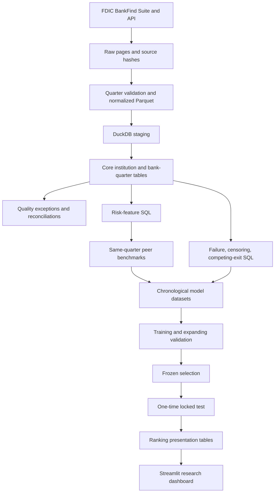
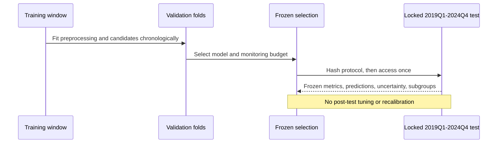
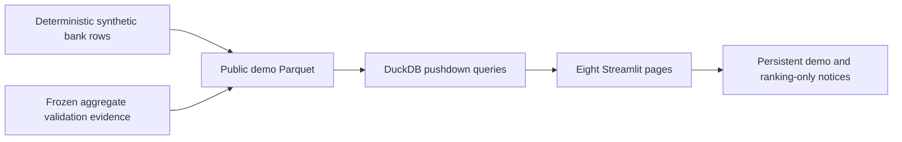

# Architecture

## End-to-end lineage

## Locked-test isolation

## Public dashboard flow

Schemas separate raw, staging, core, quality, audit, and reporting concerns. Python orchestrates transactions, manifests, tests, and exports; the principal data model, ratios, temporal logic, peers, censoring, and labels remain in SQL.
